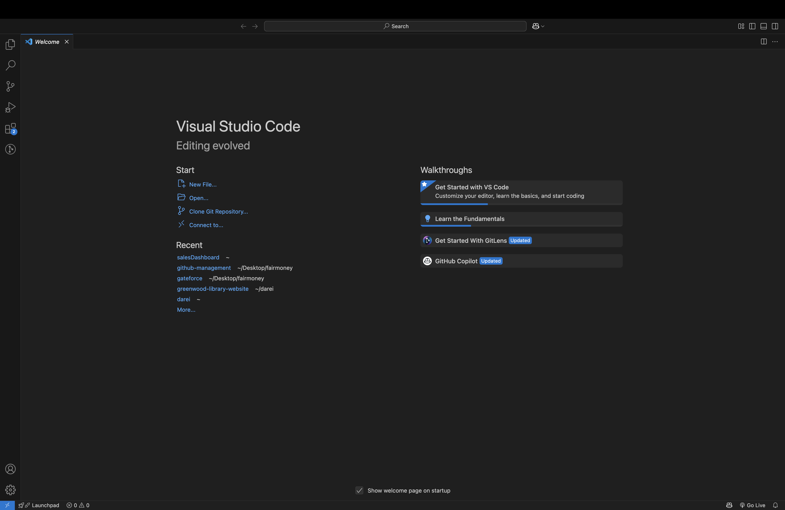
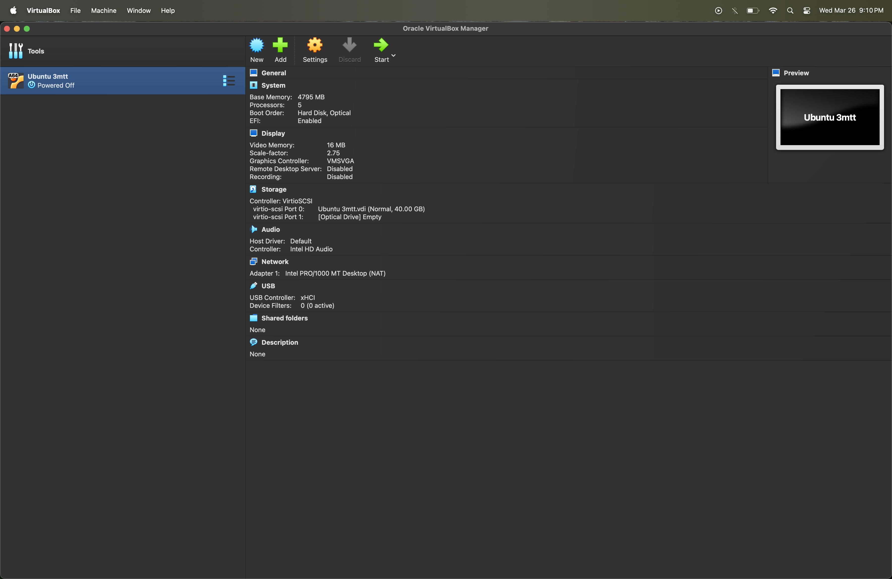
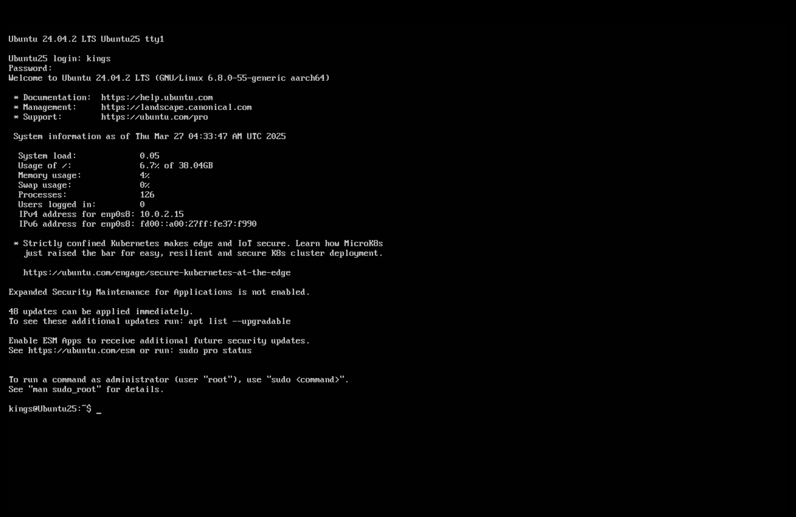
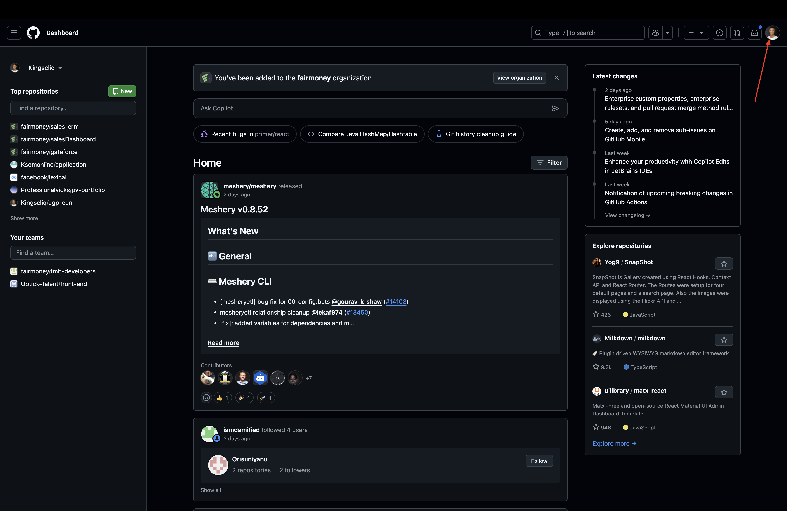
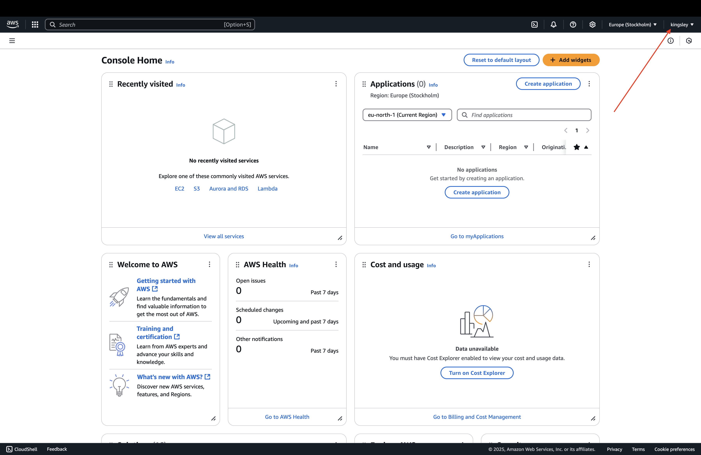

# Environment Setup Documentation

This document outlines the steps I took to set up my development environment, including the installation of Visual Studio Code, VirtualBox, Ubuntu, and the setup of GitHub and AWS accounts. Screenshots are included for better clarity.

---

## 1. Installing Visual Studio Code

I was able to successfully install Visual Studio Code by following these steps:

1. Navigated to the [official Visual Studio Code website](https://code.visualstudio.com/).
2. Downloaded the macOS installer.
3. Opened the downloaded file and followed the installation prompts.
4. Verified the installation by launching Visual Studio Code.

**Screenshot:**  


---

## 2. Installing VirtualBox

I was able to successfully install VirtualBox by doing the following:

1. Visited the [official VirtualBox website](https://www.virtualbox.org/).
2. Downloaded the macOS version of VirtualBox.
3. Opened the installer and followed the on-screen instructions.
4. Confirmed the installation by launching VirtualBox.

**Screenshot:**  


---

## 3. Installing Ubuntu

I was able to successfully install Ubuntu on VirtualBox by:

1. Downloaded the Ubuntu ISO file from the [official Ubuntu website](https://ubuntu.com/).
2. Created a new virtual machine in VirtualBox and selecting the downloaded ISO file.
3. Followed the installation steps within the virtual machine.
4. Ensured Ubuntu was running correctly in VirtualBox.

**Screenshot:**  


---

## 4. Setting Up a GitHub Account

I was able to successfully set up my GitHub account by:

1. Visited the [GitHub website](https://github.com/).
2. Clicked on "Sign up" and filling in the required details.
3. Verified my email address and completing the account setup process.
4. Configured Git on my local machine to connect with my GitHub account.

**Screenshot:**  


---

## 4. Installing Git

I was able to successfully install Git by:

1. Opened the Terminal on macOS.
2. Ran the following command to install Git using Homebrew:
   ```bash
   brew install git
   ```
   **Screenshot:**  
   

---

## 5. Setting Up an AWS Account

I was able to successfully set up my AWS account by:

1. Navigated to the [AWS website](https://aws.amazon.com/).
2. Clicked on "Create an AWS Account" and providing the necessary information.
3. Verified my identity and payment details.
4. Logged into the AWS Management Console to confirm the setup.

**Screenshot:**  

